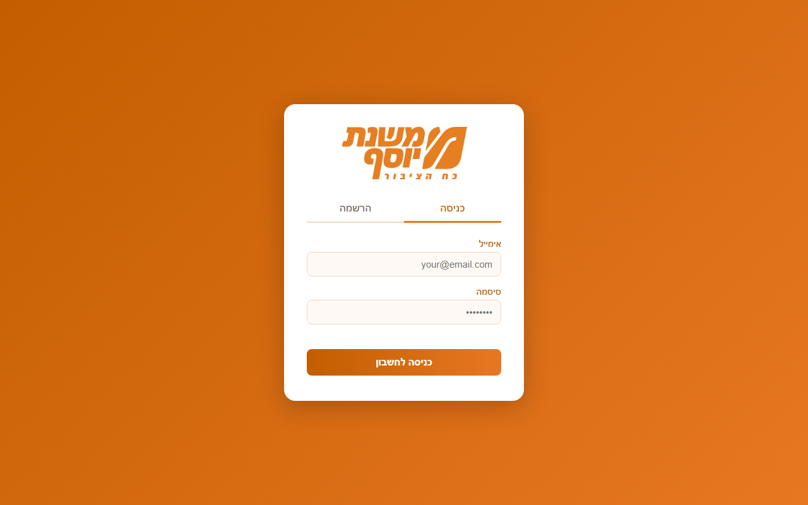

<div align="center">

# 🛒 משנת יוסף — פורטל לקוחות

### פורטל ניהול סלים ורשימות קנייה ללקוחות עסק אמיתי


[](https://mishnat-yosef-dashboard.netlify.app)

</div>

---

## 🎯 הבעיה → הפתרון

לעסק "משנת יוסף" היה צריך דרך לנהל סלי קנייה ורשימות ללקוחות בלי להסתמך על ניירת או וואטסאפ ידני. **הפורטל** נותן ללקוחות ולמנהלים ממשק אחד: ניהול סלים, סנכרון מוצרים וייבוא לקוחות — עם הרשאות לפי תפקיד (admin / לקוח).

## 📸 Screenshot

<p align="center">
  
</p>

## ✨ מה בפרויקט

- ניהול סלי קנייה ורשימות ללקוחות
- הרשאות לפי `role: admin` למנהלים (Firestore Rules)
- סנכרון מוצרים וייבוא לקוחות דרך Netlify Functions
- PWA — ממשק אחד לכל המכשירים

## 🛠️ טכנולוגיות

`HTML` `Firebase Auth` `Firestore` `Netlify Functions`

## 🌐 דמו

**[mishnat-yosef-dashboard.netlify.app](https://mishnat-yosef-dashboard.netlify.app)**

> ⚠️ **סטטוס:** בפיתוח פעיל — חיבור Firebase המלא (Auth + Firestore בסביבת production) עדיין בתהליך השלמה. ראה `mishnat-yosef/FIREBASE_SETUP_HE.md` להגדרה.

## 📦 מבנה

```
├── index.html              # האפליקציה (שורש)
├── netlify/functions/      # סנכרון מוצרים וייבוא לקוחות
├── firebase.json           # לפרסום Rules
└── firestore.rules         # הרשאות Firestore
```

## 📄 רישיון

MIT © 2026 [David Patlas](https://github.com/DavidPatlas-AI)
